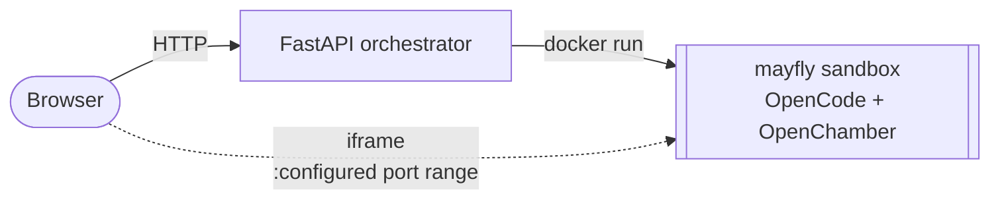

<div align="center">
  
  <h1>Mayfly</h1>
  <p><em>Disposable, browser-based coding sessions in isolated Docker sandboxes.</em></p>
  <p>
    
    
    
    
  </p>
</div>

---

One click opens a fresh OpenChamber web workspace backed by [OpenCode](https://opencode.ai), running inside its own short-lived Docker sandbox. No local editor setup, no persistent sandbox state; unwatched sessions are removed after the configured disconnect timeout.

## 🌊 Flow



Sandboxes run unprivileged on a read-only rootfs with all caps dropped, `no-new-privileges`, memory/CPU/PID caps, and ephemeral tmpfs mounts for `$HOME` and `/tmp`.

## 🚀 Quick start

You need an OpenAI-compatible inference endpoint reachable from the sandbox (e.g. vLLM, llama.cpp, Ollama, or LM Studio). Point `OPENAI_BASE_URL` / `OPENAI_MODEL` at it in `.env`; for services running on the Docker host, use `host.docker.internal` as in the example.

```bash
cp .env.example .env
docker compose --profile build build   # build app + sandbox images
docker compose up -d                   # start the FastAPI orchestrator
```

Open <http://localhost:8123>.

Each session gets a random OpenChamber UI password. The web view shows it in a modal; `POST /sessions` returns it as `password`.

## ⚙️ Tunables

Everything lives in [.env](.env.example). The ones worth knowing:

| | |
| --- | --- |
| `PUBLIC_HOST` / `APP_PORT` / `APP_BIND_HOST` | generated URLs and FastAPI host binding |
| `MAYFLY_IMAGE` | sandbox image used for per-session containers |
| `MAYFLY_MAX_SESSIONS` | concurrency cap |
| `MAYFLY_HOST_PORT_START` / `MAYFLY_HOST_PORT_END` | inclusive host port range for sandbox sessions |
| `MAYFLY_BIND_HOST` | host address used for sandbox port bindings |
| `MAYFLY_MEMORY` / `MAYFLY_CPUS` | per-sandbox resource limits |
| `MAYFLY_TMPFS_SIZE` / `MAYFLY_TMP_SIZE` | ephemeral home and `/tmp` sizes |
| `MAYFLY_WORKSPACE_DIR` | workspace directory created inside the sandbox home |
| `MAYFLY_TRANSFER_LIMIT` | max size for navbar uploads |
| `MAYFLY_CONNECT_TIMEOUT` | how long a session waits for the first browser connect |
| `MAYFLY_DISCONNECT_TIMEOUT` | how long an unwatched session survives |
| `TZ` | shared timezone for app + sandboxes |
| `OPENAI_BASE_URL` / `OPENAI_API_KEY` / `OPENAI_MODEL` | LLM endpoint, API key, and model each sandbox talks to |
| `OPENAI_CONTEXT_TOKENS` / `OPENAI_OUTPUT_TOKENS` | model token limits passed to OpenCode |
| `OPENAI_TIMEOUT` / `OPENAI_CHUNK_TIMEOUT` | request and stream idle timeouts in milliseconds |

Offline / Nexus builds: override `PIP_INDEX_URL`, `PIP_TRUSTED_HOST`,
`NPM_REGISTRY`, and `NPM_STRICT_SSL` in `.env`.

## 🌐 Surface

- **`GET /`** — browser entrypoint
- **`POST /view`** — create a browser session and redirect to `/view/{token}`
- **`GET /view/{token}`** — browser view for one session
- **`POST /sessions`** — create a session via API, returns `url` and `password`
- **`GET /sessions/status`** — active / available / limit counts
- **`POST /sessions/{token}/upload`** — password-protected upload into the sandbox workspace
- **`DELETE /sessions/{token}`** — stop a session
- **`WS /sessions/{token}/lifecycle`** — websocket used by the browser view
- **`/docs`** — OpenAPI
- **`/mcp/`** — MCP endpoint, reachable from the host at `http://localhost:8123/mcp/`

## 🧩 Layout

- [`app/`](app/) — FastAPI orchestrator
- [`docker/Dockerfile.mayfly`](docker/Dockerfile.mayfly) — per-session sandbox image (build-only profile)
- [`docker/Dockerfile.app`](docker/Dockerfile.app) — orchestrator image
