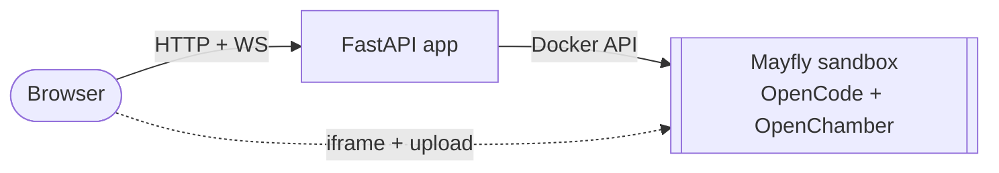

<div align="center">
  
  <h1>Mayfly</h1>
  <p><em>Disposable, browser-based coding sessions in isolated Docker sandboxes.</em></p>
  <p>
    
    
    
    
  </p>
</div>

Mayfly starts short-lived OpenChamber workspaces backed by OpenCode. Each browser session gets its own Docker sandbox, its own workspace, and its own OpenChamber UI password.

The sandboxes are intentionally disposable: no local editor setup, no persistent sandbox state, and automatic cleanup after disconnect.

## 🛠️ How It Works



- The FastAPI app creates and tracks sessions.
- Each session starts one sandbox container on an allocated host port.
- The browser embeds OpenChamber directly in an iframe.
- `$HOME` and `/tmp` inside the sandbox are tmpfs mounts, so every new session starts clean.
- `docker/entrypoint.sh` generates OpenCode config, OpenChamber settings, the workspace directory, and a small `AGENTS.md`.

## 📋 Requirements

- Docker with access to `/var/run/docker.sock`
- Python 3.13+ for local development
- An OpenAI-compatible model endpoint reachable from the sandbox, for example Ollama, vLLM, llama.cpp, or LM Studio

For model services running on the Docker host, use `host.docker.internal` in `.env`.

## 🚀 Quick Start

```bash
cp .env.example .env
docker compose --profile build build
docker compose up -d
```

Open <http://localhost:8123>.

When changing files under `docker/`, rebuild the sandbox image before starting new sessions:

```bash
docker compose --profile build build mayfly
```

## ⚙️ Configuration

All runtime configuration lives in [.env](.env.example).

| Variable | Purpose |
| --- | --- |
| `PUBLIC_HOST`, `APP_PORT`, `APP_BIND_HOST` | external URL generation and FastAPI bind address |
| `TZ` | timezone applied to the app and every sandbox |
| `MAYFLY_IMAGE` | per-session sandbox image |
| `MAYFLY_HOST_PORT_START`, `MAYFLY_HOST_PORT_END` | host port range for sandbox containers |
| `MAYFLY_BIND_HOST` | bind address for sandbox ports |
| `MAYFLY_MAX_SESSIONS` | max concurrent sessions |
| `MAYFLY_MEMORY`, `MAYFLY_CPUS` | per-sandbox resource limits |
| `MAYFLY_HOME_SIZE`, `MAYFLY_TMP_SIZE` | sandbox `$HOME` and `/tmp` tmpfs sizes |
| `MAYFLY_WORKSPACE_DIR` | workspace directory inside the sandbox home |
| `MAYFLY_UPLOAD_LIMIT` | max upload size into the workspace |
| `MAYFLY_CONNECT_TIMEOUT`, `MAYFLY_DISCONNECT_TIMEOUT` | cleanup timing for unused sessions |
| `OPENAI_BASE_URL`, `OPENAI_API_KEY`, `OPENAI_MODEL` | model endpoint passed to OpenCode |
| `OPENAI_CONTEXT_TOKENS`, `OPENAI_OUTPUT_TOKENS` | model limits passed to OpenCode |
| `OPENAI_TIMEOUT`, `OPENAI_CHUNK_TIMEOUT` | OpenCode provider request timeouts |

For offline or Nexus builds, override `PIP_INDEX_URL`, `PIP_TRUSTED_HOST`, `NPM_REGISTRY`, and `NPM_STRICT_SSL`.

## 🔌 API Surface

- `GET /` - browser entrypoint
- `POST /view` - create a browser session and redirect to `/view/{token}`
- `GET /view/{token}` - browser view for one session
- `POST /sessions` - create a session via API, returns `url` and `password`
- `GET /sessions/status` - active, available, and limit counts
- `POST /sessions/{token}/upload` - password-protected file upload into the workspace
- `DELETE /sessions/{token}` - stop a session
- `WS /sessions/{token}/lifecycle` - browser lifecycle channel
- `/docs` - OpenAPI docs
- `/mcp/` - MCP endpoint

Static UI assets are served under `/static/*`; `/favicon.ico` serves the Mayfly logo.

## 🛡️ Security Model

Sandbox containers run as an unprivileged user with a read-only root filesystem, dropped Linux capabilities, `no-new-privileges`, PID/memory/CPU limits, and tmpfs mounts for writable runtime state.

Mayfly is still alpha. If you bind the app or sandbox ports to a public interface, put it behind trusted network controls.

## 🧩 Layout

- [`app/`](app/) - FastAPI app, routers, services, templates, and static UI assets
- [`docker/Dockerfile.app`](docker/Dockerfile.app) - orchestrator image
- [`docker/Dockerfile.mayfly`](docker/Dockerfile.mayfly) - per-session sandbox image
- [`docker/entrypoint.sh`](docker/entrypoint.sh) - sandbox startup config for OpenCode, OpenChamber, and workspace instructions
- [`docker-compose.yml`](docker-compose.yml) - app service, build profile, and shared Docker network
