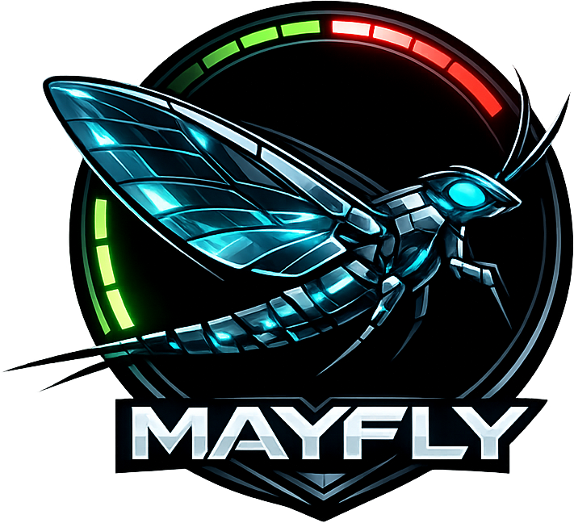

<p align="center">
  
</p>

---


> Ephemeral `OpenCode` containers per browser session, with `OpenChamber` as the frontend. Close the tab and the container is gone.

## ⚡ Setup

```bash
cp .env.example .env
uv sync
docker build -t opencode-mayfly:0.1.0 docker/opencode/
```

The build tag must match `DOCKER_IMAGE` in `.env`.

## 🚀 Start

```bash
uv run uvicorn app.main:app --host 0.0.0.0 --port 8000
```

↻ Auto reload: add `--reload`.

## ↺ Flow

1. `POST /session` creates a session and starts a dedicated OpenCode container.
2. The `OpenChamber` frontend then connects to `WS /session/{token}/lifecycle`.
3. If the WebSocket connection ends, or is not established within `CONTAINER_TIMEOUT`, the session is closed and the container is removed.

When the app shuts down, Mayfly also cleans up any remaining open sessions.

## ⚙ Configuration (`.env`)

| Variable | |
|---|---|
| `DOCKER_IMAGE` | Container image |
| `DOCKER_PORT` | Port inside the container |
| `MAX_CONTAINERS` | Maximum number of sessions |
| `CONTAINER_MEMORY` | RAM per container |
| `CONTAINER_CPUS` | CPU allocation per container |
| `CONTAINER_TMPFS_SIZE` | `/home/user` tmpfs |
| `CONTAINER_TIMEOUT` | Seconds before aborting if no lifecycle WebSocket connects |
| `OPENAI_BASE_URL` | OpenAI-compatible API |
| `OPENAI_MODEL` | Model name |
| `OPENAI_CONTEXT_SIZE` | Context window |
| `OPENAI_OUTPUT_SIZE` | Maximum output tokens |

Default values are defined in `.env.example`.

## 🐳 Docker-Image

The container image currently installs `opencode-ai` and `OpenChamber` as the web frontend:

| Paket | Version |
|---|---|
| `opencode-ai` | `1.14.22` |
| `@openchamber/web` | `1.9.8` |

## 🛰 API

| | | |
|---|---|---|
| `GET`  | `/`                          | Landing page |
| `GET`  | `/status`                    | `{open, free, max}` |
| `POST` | `/session`                   | Start container → `{token, url}` · `503` if the limit is reached or startup fails |
| `WS`   | `/session/{token}/lifecycle` | Connection ends ⇒ close session and stop container |
| `*`    | `/mcp`                       | Streamable HTTP MCP |
