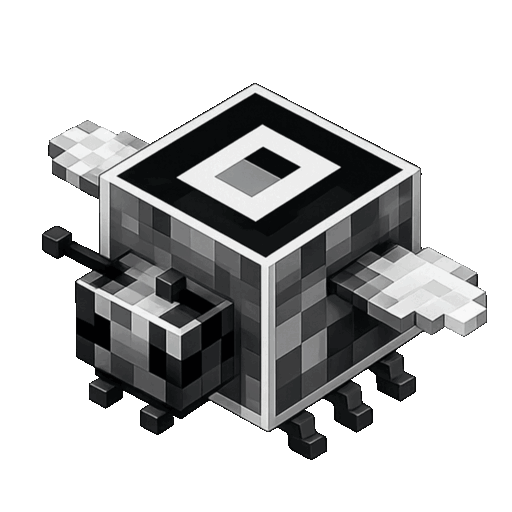
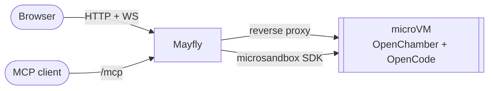

<div align="center">
  
  <h1>Mayfly</h1>
  <p><em>Disposable OpenChamber coding sessions in microVMs.</em></p>
  <p>
    <a href="https://github.com/Th3R3alDuk3/Mayfly/actions/workflows/docker.yml"></a>
    <a href="https://github.com/Th3R3alDuk3/Mayfly/tags"></a>
    <a href="pyproject.toml"></a>
    <a href="LICENSE"></a>
  </p>
</div>

Every session boots its own microVM running [OpenChamber](https://github.com/openchamber/openchamber)
on [OpenCode](https://github.com/anomalyco/opencode), hands out a link and a password, and destroys
the VM once the browser tab is closed. Built on [microsandbox](https://github.com/superradcompany/microsandbox).

## 🛠️ How It Works



- `GET /` returns this browser's session as JSON, starting one if none is open. `POST /sessions` and the
  `create_mayfly_session` MCP tool always start a new one. All return `url` and `password`.
- Opening the link sets a session cookie and serves OpenChamber; from then on the origin is reverse-proxied into the VM.
- OpenChamber asks for the password. Its file tree accepts drag-and-drop uploads, so files go straight into the workspace.
- A session with no open browser connection for `SANDBOX_IDLE_TIMEOUT` seconds is destroyed; `SANDBOX_MAX_DURATION` caps its lifetime.

## 🚀 Setup

Requires a Linux host with **KVM** and [uv](https://docs.astral.sh/uv/). The
server's user must be able to read and write `/dev/kvm`; `uv run msb doctor`
checks that.

Turn nested virtualization off on the host (`kvm_amd` on AMD). With it on,
sessions get a working `/dev/kvm` inside their microVM and reach the host's
nested-virtualization code:

```bash
echo "options kvm_intel nested=0" | sudo tee /etc/modprobe.d/kvm-nested.conf
sudo modprobe -r kvm_intel && sudo modprobe kvm_intel
```

1. Install and configure:

   ```bash
   uv sync
   cp .env.example .env
   cp config/opencode.example.json config/opencode.json
   ```

   - `PUBLIC_URL`: URL clients reach this server at; used in session links.
   - `SANDBOX_ALLOW`: everything a sandbox may reach. `host:PORT` is a service on this
     machine (`host.microsandbox.internal` inside the VM), anything else `DOMAIN[:PORT]`.
     Keep the model endpoint and the Python package index in it; the rest of the network is denied.
   - [config/opencode.json](config/opencode.example.json): the [OpenCode config](https://opencode.ai/docs/config/)
     every session starts with. Edit it any time; the next session picks it up.
     `config/` is mounted read-only into the VM at `/etc/mayfly`, so `instructions` can reference
     [config/AGENTS.md](config/AGENTS.md).

2. Build the sandbox image and load it into microsandbox:

   ```bash
   docker compose --profile build build mayfly
   docker save mayfly:0.4.0 | uv run msb load
   ```

   Or pull the prebuilt one: `uv run msb pull ghcr.io/th3r3alduk3/mayfly:latest` and set `SANDBOX_IMAGE` accordingly.

3. Start the server. Open <http://localhost:8123> for a session, or connect an MCP client to `http://localhost:8123/mcp`:

   ```bash
   uv run python main.py
   ```

Neither endpoint has authentication; put Mayfly behind trusted network controls.

## 📦 Sandbox image

[docker/Dockerfile.mayfly](docker/Dockerfile.mayfly) starts from `python:3.13-slim` and adds
git, ripgrep, fd, uv, ruff, basedpyright, OpenCode and OpenChamber. Node is installed from PyPI
(`nodejs-wheel-binaries`) and only runs OpenChamber, so the build needs nothing but a PyPI and an
npm registry. Both, the pinned tool versions and the index the sandbox's `pip`/`uv` use, come from
`.env`:

```bash
PIP_INDEX_URL=https://nexus.example.com/repository/pypi/simple
PIP_TRUSTED_HOST=nexus.example.com
NPM_REGISTRY=https://nexus.example.com/repository/npm/
```

## 🐳 Docker

The server runs in a container with the same `.env`. It needs the KVM device, a volume so loaded
images survive restarts, and the config directory:

```bash
docker compose up -d
docker save mayfly:0.4.0 | docker compose exec -T app uv run --no-sync msb load
```

A prebuilt server image is available as `ghcr.io/th3r3alduk3/mayfly-app:latest`.

## 🛡️ Security

- **Isolation:** every session is its own microVM with its own kernel (KVM via libkrun) and the
  restricted in-guest security profile, fixed RAM/vCPU caps and a disposable disk.
- **Network:** denied by default; only `SANDBOX_ALLOW` destinations and DNS are reachable.
  No VM can see another one or the host beyond the listed ports.
- **Access:** a session is reachable only through its unguessable link, then guarded by
  OpenChamber's password. The VM's port is bound to the server's loopback.
- **Host access:** the server needs `/dev/kvm` only.

## 🧩 Layout

- [`main.py`](main.py) - FastAPI app, MCP mount, lifespan
- [`routes.py`](routes.py) - session API, cookie hand-off, reverse proxy
- [`services/sandbox.py`](services/sandbox.py) - microVM boot and teardown
- [`services/session.py`](services/session.py) - session registry and idle reaper
- [`services/proxy.py`](services/proxy.py) - HTTP and WebSocket proxy into the VM
- [`tools/`](tools/) - MCP tools
- [`docker/`](docker/) - server and sandbox images
